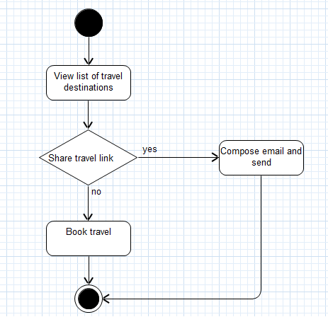
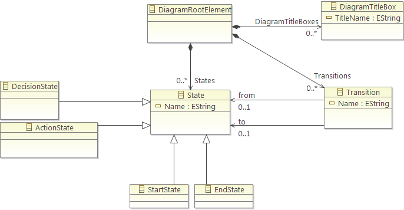

### Used software

* [Eclipse Modeling Tools](http://www.eclipse.org/downloads/packages/eclipse-modeling-tools/keplerr)
    * Plugin [Graphiti](http://www.eclipse.org/graphiti/)
    * Plugin [Spray](https://code.google.com/a/eclipselabs.org/p/spray/)
    * Plugin [MOFScript](http://www.eclipse.org/gmt/mofscript/)

### Getting started

* Start Eclipse Modeling Tools IDE
* Import `org.example.demo.activitydiagram` and `org.example.demo.activitydiagram.ad_editor` into Eclipse

Generate code
* Open the `org.example.demo.activitydiagram/model/activitydiagram_model.genmodel` file
* Rightclick on `Activitydiagram_model` > `Generate Model Code`

Run the editor
* Run `org.example.demo.activitydiagram.ad_editor` as `Eclipse Application`
* Import `DemoActivityDiagramEditor`

Transform the diagram to text
* Open the `DemoActivityDiagramEditor\MOFScript\ActivityDiagramEditor.m2t` file
* Click the run button and choose as `source code model` the ``DemoActivityDiagramEditor/model` folder 

### Illustration

With the editor you can create activity diagrams like the following:



These diagrams are base on the underlying model, which is defined in the EMF Project:



With the included MOFScript it is possible to transform the above activity diagram to text:

```
******************* Start *******************
STATE: StartState 
TRANISTION: name:'', from:StartState(''), to:ActionState('View list of travel destinations')
TRANISTION: name:'', from:ActionState('View list of travel destinations'), to:DecisionState('Share travel link')
TRANISTION: name:'no', from:DecisionState('Share travel link'), to:EndState('')
TRANISTION: name:'yes', from:DecisionState('Share travel link'), to:ActionState('Compose email and send')
TRANISTION: name:'', from:ActionState('Compose email and send'), to:EndState('')
TRANISTION: name:'', from:ActionState('Book travel'), to:EndState('')
******************* End *******************
```